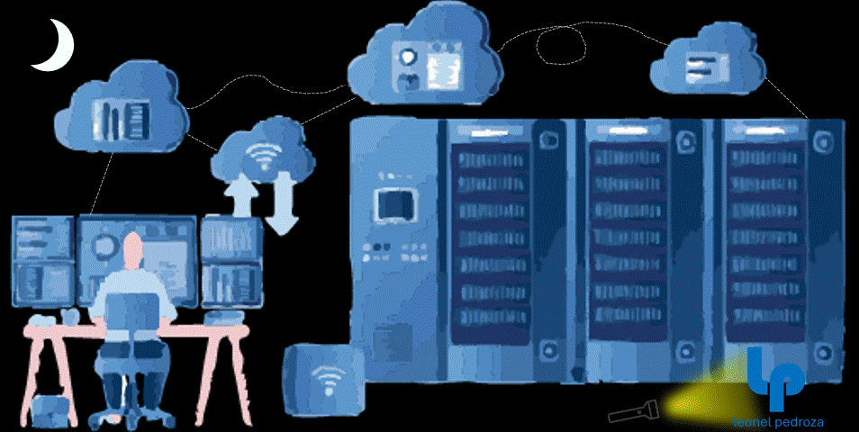

# 👽 Leonel Pedroza
<div align="center">

<!-- Glitch effect title -->


<!-- Theme-aware animated GIF banner with pulse effect -->
<picture>
  <source media="(prefers-color-scheme: light)" srcset="lpedroza-light.gif">
  <source media="(prefers-color-scheme: dark)" srcset="lpedroza-dark.gif">
  
</picture>

<!-- Matrix-style typing effect -->
<picture>
  <source media="(prefers-color-scheme: light)" srcset="https://readme-typing-svg.herokuapp.com?font=JetBrains+Mono&size=18&duration=3000&pause=800&color=0366D6&center=true&vCenter=true&width=800&lines=%3E%3E%3E+Initializing+Neural+Network...;%3E%3E%3E+Loading+Cyber+Protocols...;%3E%3E%3E+Electronic+%26+Telecommunications+Engineer;%3E%3E%3E+Network+Security+Specialist;%3E%3E%3E+Python+%7C+C%2B%2B+%7C+Cybersecurity+Expert;%3E%3E%3E+Building+The+Future+of+Security...;%3E%3E%3E+Access+Granted+%F0%9F%94%93">
  <source media="(prefers-color-scheme: dark)" srcset="https://readme-typing-svg.herokuapp.com?font=JetBrains+Mono&size=18&duration=3000&pause=800&color=00FF41&center=true&vCenter=true&width=800&lines=%3E%3E%3E+Initializing+Neural+Network...;%3E%3E%3E+Loading+Cyber+Protocols...;%3E%3E%3E+Electronic+%26+Telecommunications+Engineer;%3E%3E%3E+Network+Security+Specialist;%3E%3E%3E+Python+%7C+C%2B%2B+%7C+Cybersecurity+Expert;%3E%3E%3E+Building+The+Future+of+Security...;%3E%3E%3E+Access+Granted+%F0%9F%94%93">
  
</picture>

<!-- Enhanced badges with animations -->
<div>
  
  
  
  
</div>

</div>

## 🛸 System.Initialize()

<table>
<tr>
<td>

```python
#!/usr/bin/env python3
# -*- coding: utf-8 -*-

class NetworkSecurityAnalyst:
    def __init__(self):
        self.name = "Leonel Pedroza"
        self.role = "📡 Network Security Analyst"
        self.location = "🌍 Earth (Sometimes Astrophysics 🌌)"
        self.motto = "Solo shot first 🎯"
        
        # Core Systems
        self.brain = {
            "specialties": [
                "🛡️ Network Security",
                "📡 Telecommunications",
                "🌐 Network Architecture",
                "🔍 Network Analysis",
                "⚡ Automation & Scripting"
            ],
            "languages": [
                "🐍 Python", "⚙️ C/C++", "💎 C#", 
                "📋 BASIC", "💙 PowerShell", "🌐 HTML/CSS/JS"
            ]
        }
        
        self.current_mission = "Building secure telecommunications networks 📡"
        self.status = "🟢 ONLINE - Ready to deploy!"
    
    def secure_networks(self):
        return "🌍 One secure network at a time! 📡"
    
    def coffee_level(self):
        return "☕ [████████████] 100% - Fully caffeinated!"

# Initialize the legend
leonel = NetworkSecurityAnalyst()
print(leonel.secure_networks())
print(leonel.coffee_level())
```

</td>
<td>

<!-- 3D Rotating Cube ASCII Art -->
```
        🔐 TELECOMMUNICATIONS MATRIX 🔐
    
    ████████████████████████████
    █                          █
    █    📡  NETWORK SECURITY   █
    █    📞  TELECOMMUNICATIONS █
    █    🌐  NETWORK ANALYSIS   █
    █    🔍  PROTOCOL ANALYSIS  █
    █    ⚡  NETWORK AUTOMATION █
    █                          █
    ████████████████████████████
    
         📡 LEVEL: EXPERT 📡
```

</td>
</tr>
</table>

## 🚀 Arsenal.LoadWeapons()

<div align="center">

### 🎯 Core Technology Systems
<table>
<tr>
<td align="center" width="200">

**🐍 PYTHON MASTERY**
<br>

<br>
`Advanced Scripting & Automation`

</td>
<td align="center" width="200">

**⚙️ SYSTEM PROGRAMMING**
<br>


<br>
`Low-level Performance`

</td>
<td align="center" width="200">

**🔧 SCRIPTING & AUTOMATION**
<br>

<br>
`Automation Specialist`

</td>
<td align="center" width="200">

**📊 DATA ANALYSIS**
<br>


<br>
`Analytics & Legacy Systems`

</td>
</tr>
</table>

### 🛡️ Network Security Arsenal
<table>
<tr>
<td align="center">


</td>
</tr>
<tr>
<td align="center">


</td>
</tr>
<tr>
<td align="center">


</td>
</tr>
</table>

</div>

## 📊 Neural Network.Stats()

<div align="center">

<!-- Animated GitHub Stats Cards -->


<!-- GitHub Streak Stats -->


</div>

## 🏆 Achievement.Unlock()

<div align="center">

<!-- GitHub Trophies -->


</div>

## 🔬 Projects.ShowCase()

<div align="center">

<!-- Enhanced Project Cards with descriptions -->
<table>
<tr>
<td width="50%">

[](https://github.com/leonelpedroza/IP_monitor)
**🔍 Real-time IP monitoring & threat detection**

</td>
<td width="50%">

[](https://github.com/leonelpedroza/Sanitizzer)
**🧹 Advanced data sanitization toolkit**

</td>
</tr>
<tr>
<td width="50%">

[](https://github.com/leonelpedroza/Network-Device-Tracer)
**📡 Network topology discovery & mapping**

</td>
<td width="50%">

[](https://github.com/leonelpedroza/IP_Port_Scanner)
**⚡ Lightning-fast port enumeration tool**

</td>
</tr>
</table>

</div>

## 🎯 Mission.CurrentObjectives()

<div align="center">

```ascii
┌─────────────────────────────────────────────────────────────┐
│  🚀 ACTIVE MISSIONS                                         │
├─────────────────────────────────────────────────────────────┤
│  📡 Building next-gen telecommunications networks           │
│  🌐 Developing network monitoring and analysis tools       │
│  🛡️ Creating network security protocols and frameworks    │
│  📞 Exploring VoIP and unified communications              │
│  ⚡ Automating network configuration and management        │
│  🔍 Research into network performance optimization         │
└─────────────────────────────────────────────────────────────┘
```

</div>

## 📈 Activity.RealTimeMatrix()

<!-- Enhanced Contribution Graph -->
<picture>
  <source media="(prefers-color-scheme: light)" srcset="https://github-readme-activity-graph.vercel.app/graph?username=leonelpedroza&theme=github-compact&bg_color=ffffff&color=0366d6&line=0366d6&point=ffffff&area=true&hide_border=true">
  <source media="(prefers-color-scheme: dark)" srcset="https://github-readme-activity-graph.vercel.app/graph?username=leonelpedroza&theme=react-dark&bg_color=0d1117&color=00ff41&line=00ff41&point=ffffff&area=true&hide_border=true">
  
</picture>

## 🌐 Network.ConnectProtocols()

<div align="center">

<!-- Social Media Links with Hover Effects -->
<table>
<tr>
<td align="center">

[](https://www.linkedin.com/in/leonelpedroza/)
<br>**Professional Network**

</td>
<td align="center">

[](https://x.com/leonelpedroza)
<br>**Tech Updates**

</td>
<td align="center">

[](https://www.instagram.com/leonelpedroza64/)
<br>**Behind the Scenes**

</td>
<td align="center">

[](https://www.facebook.com/leonel.r.9)
<br>**Community**

</td>
</tr>
</table>

</div>

## 💡 Wisdom.RandomOutput()

<div align="center">

<!-- Enhanced Quote with Animation -->
<picture>
  <source media="(prefers-color-scheme: light)" srcset="https://quotes-github-readme.vercel.app/api?type=horizontal&theme=light&animation=grow_out_in">
  <source media="(prefers-color-scheme: dark)" srcset="https://quotes-github-readme.vercel.app/api?type=horizontal&theme=dark&animation=grow_out_in">
  
</picture>

</div>

## 🐍 ContributionMatrix.Visualize()

<div align="center">

<!-- Animated Snake eating contributions -->
<picture>
  <source media="(prefers-color-scheme: light)" srcset="https://github.com/leonelpedroza/leonelpedroza/blob/output/github-contribution-grid-snake.svg">
  <source media="(prefers-color-scheme: dark)" srcset="https://github.com/leonelpedroza/leonelpedroza/blob/output/github-contribution-grid-snake-dark.svg">
  
</picture>

</div>

---

<div align="center">

### 🔥 Performance Metrics


</div>

---

<div align="center">

```ascii
╔══════════════════════════════════════════════════════════════╗
║  ⚡ "In a world of vulnerabilities, be the patch" ⚡        ║
║                                                              ║
║     📡 Building secure networks, one packet at a time 📡    ║
╚══════════════════════════════════════════════════════════════╝
```


</div>
